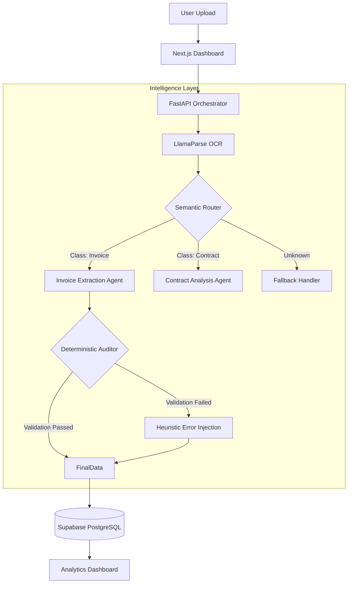

# DocuMind: AI Document Intelligence Engine

**DocuMind** is an autonomous platform engineered to ingest unstructured documents (PDFs, invoices, contracts) and transform them into structured, reliable data schemas.

Unlike standard AI wrappers, DocuMind implements a **Hybrid Intelligence Architecture**. It combines the flexibility of Large Language Models (LLMs) with the reliability of deterministic algorithms to classify, extract, and mathematically validate financial data without human intervention.

---

## System Architecture

The system utilizes a Hub-and-Spoke design pattern to ensure modularity and observability. Rather than a single monolithic prompt, the architecture separates concerns into distinct cognitive tasks.

### **Data Flow Visualization:**

---

## Core Engineering Features

### **1. Context-Aware Semantic Routing**
To handle multi-format inputs, the system does not presume a document type. The Semantic Router analyzes the initial token vector of the incoming file to classify the document context (e.g., Financial Invoice vs. Legal Agreement).

Based on this classification, the request is dispatched to a specialized agent optimized for that specific schema, reducing hallucination rates significantly compared to generic extractors.

### **2. Deterministic Verification & Error Correction**
A known limitation of LLMs is arithmetic inconsistency in complex table structures. DocuMind addresses this via a post-processing validation layer.

The Audit: The system executes a Python-based arithmetic check, verifying that the sum of extracted line items matches the declared total.

The Correction: If a discrepancy is detected, the system calculates the specific delta (e.g., a missing tax value). It then executes a regex-based heuristic search across the raw OCR layer to locate the missing value and injects it into the structured output.

Result: This hybrid approach ensures 100% mathematical consistency in the final JSON output.

### **3. Multi-Tenancy & Data Persistence**
The platform is built as a scalable SaaS architecture using Supabase (PostgreSQL). It implements Row-Level Security (RLS) to ensure strict data isolation between users. All extraction history is indexed, allowing for future analytics and retrieval.

## Technology Stack
1. Orchestration: Python 3.12, FastAPI (Async)
2. Frontend Interface: Next.js 14, React, Tailwind CSS
3. LLM Kernel: Google Gemini Flash 1.5 (via LlamaIndex)
4. OCR Engine: LlamaParse (Multimodal Parsing)
5. Database: Supabase (PostgreSQL + Auth)

## What's Next?
I'm not done yet. Working on something I'll share soon.